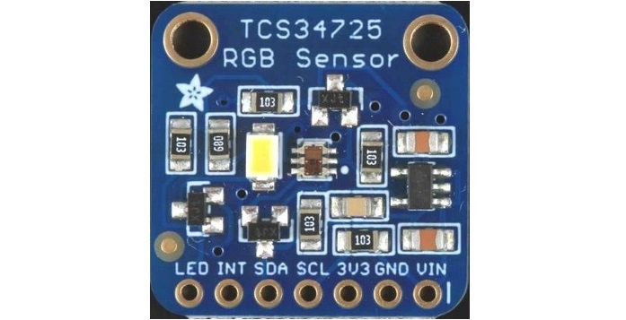
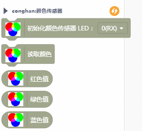

# TCS34725颜色传感器 mind+库




---------------------------------------------------------

## 目录

* [相关链接](#相关链接)
* [描述](#描述)
* [积木列表](#积木列表)
* [示例程序](#示例程序)
* [许可证](#许可证)
* [支持列表](#支持列表)
* [更新记录](#更新记录)

## 相关链接
* 本项目加载链接: ``````

* 用户库教程链接: ``````


## 描述
利用adafruit的tcs34725库，把读取到的内容转换为共阴极rgb数据

## 积木列表




## 示例程序


## 许可证

MIT

## 支持列表

主板型号                | 实时模式    | ArduinoC   | MicroPython    | 备注
------------------ | :----------: | :----------: | :---------: | -----
arduino UNO        |             |       √       |             |  


## 更新日志
* V0.0.1  基础功能完成
